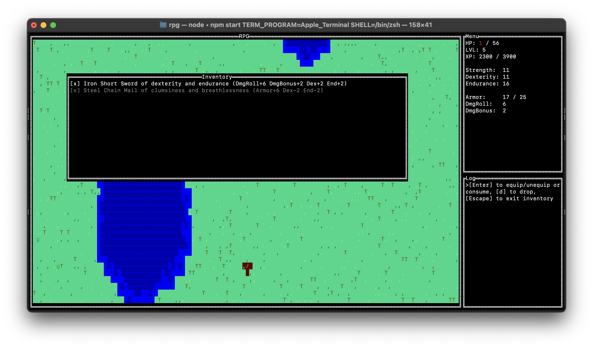

# RPG
This is a simple roguelike game I put together in a spare time on my vacation.

## How to launch
1. You have to have [Node.js](https://nodejs.org/en) installed
2. Run `npm start`

## Backlog
- Make inventory save active position when equiping items
- Items dropped should not destroy items that lay on the current tile
- Fast NPCs should be able to attack the player when the player is retreating
- NPCs' fleeing. Right now it uses CPU a lot and has weird issues
- Add more details to the game map
- Add more monsters
- Display current player's stats
- Add ring items
- Add amulet items
- Add new weapon modifiers (e.g., leach live + anti-leach live)
- Add new monster modifiers (e.g., leach life)
- Fix a bug when a player might start in an ocean
- Monsters' shouting should attract other monsters
- Add idle animations
- Add more levels - e.g. auto-scaling dungeons
  - Add doors and keys to the dungeons
- Handle window resize
- Handle game endings better (right now you have to Ctrl+C once the hero is dead + you have no idea if there are more monsters)

## References
I took the games as inspirations. I had a lot of fun playing each one of them, and I highly recommend them. 

### Dwarf Fortress
- https://www.bay12games.com/dwarves/

### Dungeon Crawl
- https://crawl.develz.org/
- https://github.com/crawl/crawl

### Diablo 2
- https://diablo2.blizzard.com/en-us/
